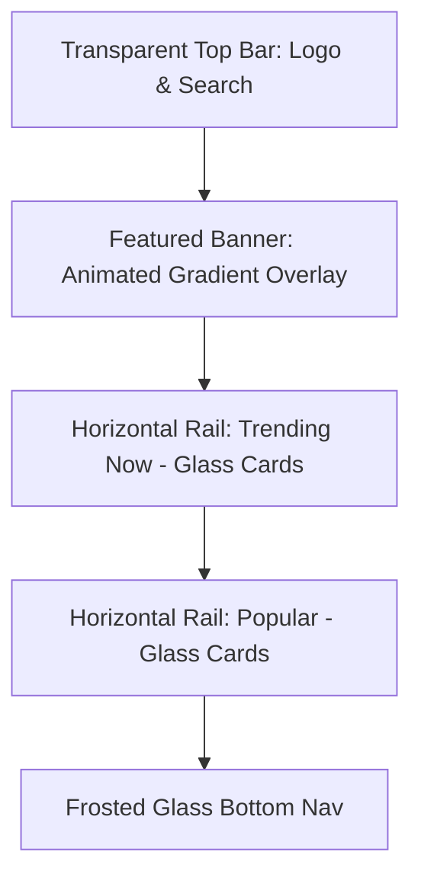
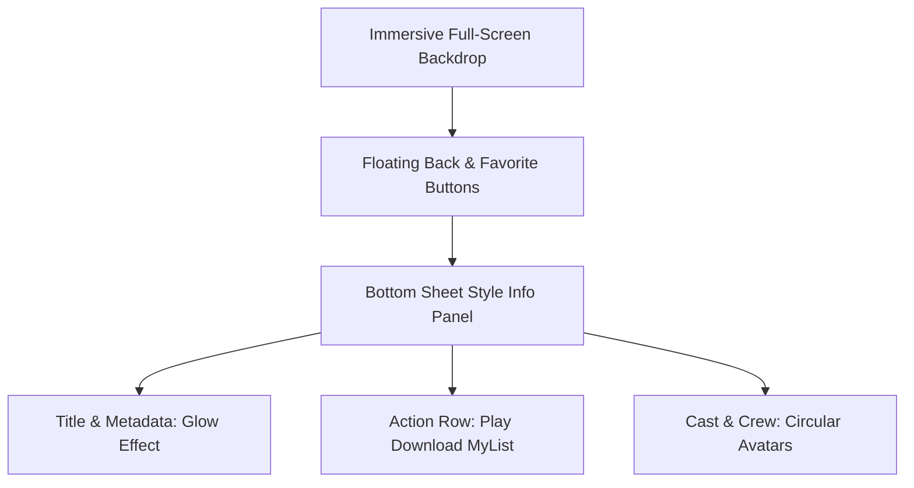

# Cine Sphere - "Glass Evolution" Design Proposal

This proposal outlines a new, high-end "Glassmorphism" UI for the Cine Sphere app. It moves away from standard Material 3 into a more custom, cinematic experience.

## Visual Direction: Glassmorphism & Depth

| Element | Specification |
| :--- | :--- |
| **Background** | Deep Midnight (#080808) with subtle #E50914 radial glows in corners. |
| **Surface** | Frosted Glass (White/10% opacity) with 20dp Backdrop Blur. |
| **Borders** | Super-fine 1dp strokes (#FFFFFF20) for that "glass edge" look. |
| **Accent** | "Neon Pulse" Red (#FF1A1A) for primary actions. |
| **Typography** | Sans Serif (Inter/Roboto), High contrast, Bold headings. |

## Layout Mockups (Mermaid Visualization)

### Home Screen Layout

### Movie Details Concept

## Proposed Component Changes

### 1. The "GlassCard"
The current `MovieCard` will be wrapped in a custom glass container.
- **Effect**: `Modifier.background(Color.White.copy(0.05f)).border(1.dp, Color.White.copy(0.1f))`
- **Shadow**: Custom ambient shadow with red tint for trending items.

### 2. Immersive Details Panel
Instead of a standard scrolling list, the details will feature a fixed backdrop with a sliding glass panel that contains the synopsis and cast.

### 3. Glass Bottom Navigation
The bottom bar will be floating and translucent, allowing the background colors to peak through.

## Next Plan: The "Immersive" Implementation
1.  **Refactor Theme**: Define the Glass-specific color palette and shapes.
2.  **Global Glass Modifiers**: Create reusable modifiers for blur and frosted effects.
3.  **Screen Overhaul**:
    - Update `HomeScreen` with parallax banner.
    - Update `DetailsScreen` with sliding glass panel.
    - Update `App` with the floating bottom bar.
